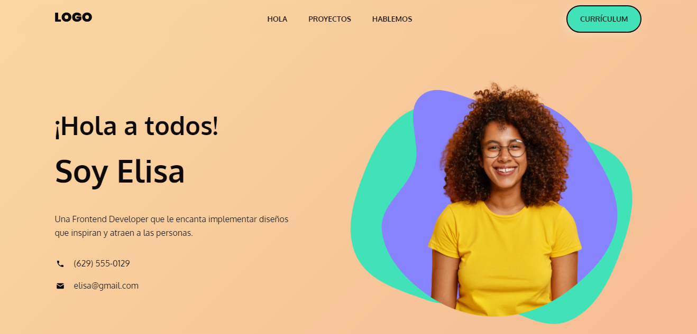
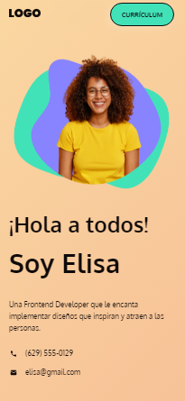

# Portafolio-Elisa
Este es un proyecto implementado desde un diseño en Figma, utilizando la técnica Flexbox Layout y Componentes al 100%.
Puedes encontrar más proyectos por implementar en la plataforma: [leonidasesteban.com](https://leonidasesteban.com/proyectos")

## Portafolio-Elisa on desktop

## Portafolio-Elisa on mobile

### Features

- DOM,
- Navigation,
- Mobile responsive

## Technologies

- HTML
- CSS - Flexbox Layout
- Responsive Design

### Contact

- Website [Portafolio-elisa](https://estebanpajares.github.io/portafolio-elisa/)

### Licence

- Copyright © 2022 [Esteban Pajares](https://github.com/EstebanPajares)